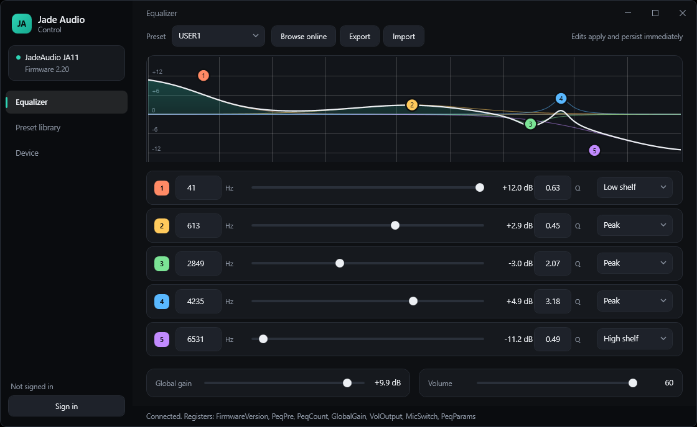
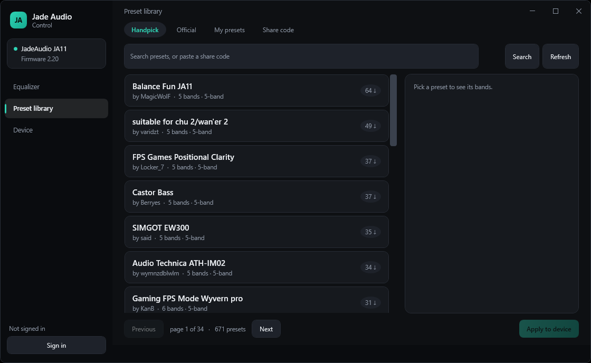
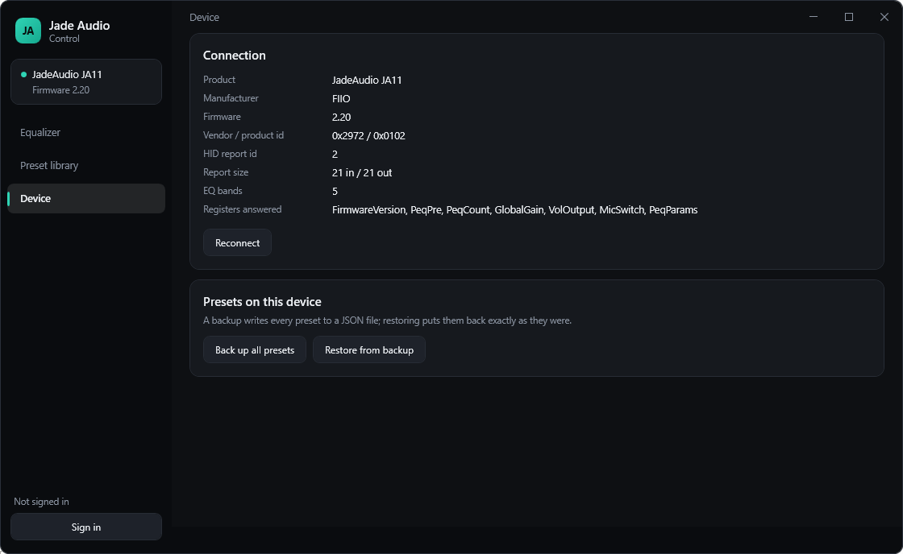
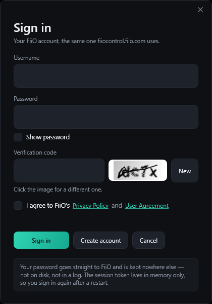

# Jade Audio Control — WPF edition

A native Windows app for FiiO / JadeAudio USB dongles, in C# on WPF, targeting
**.NET Framework 4.8**. Same protocol work as the Python edition in the parent
folder, rebuilt around a custom-drawn interface.

Developed and verified against a **JadeAudio JA11** (VID `0x2972`, PID `0x0102`,
firmware 2.20).



## Running

`dist\Jade Audio Control.exe` is a single 187 KB file. Copy it anywhere and
double-click — there is nothing beside it, not even a `.config`.

.NET Framework 4.8 ships with Windows 10 1903 and later and with Windows 11, so
on any current machine it simply runs. On Windows 7 SP1 or 8.1 it needs the 4.8
runtime installed once, from <https://dotnet.microsoft.com/download/dotnet-framework/net48>.

Targeting 4.8 rather than .NET 8 is what makes that reach possible: .NET 8 does
not support Windows 7 at all, and a self-contained .NET 8 build of this app came
to 69 MB against 187 KB here.

## What is in it

**Equalizer** — the response plot draws one translucent trace per band, the
summed curve on top with a gradient fill under it, and a handle per band you can
drag. Editing a value in a row moves the handle and the other way round; writes
are debounced so a drag does not flood the device.

**Preset library** — Handpick (671 community presets for the JA11), Official,
My presets, and lookup by share code, with search and paging.



**Device** — what the dongle reports about itself, plus backup and restore of
every preset to a JSON file.



## Nothing ships beside the exe

No NuGet package reaches the output, which is what keeps it one file:

| need | what it uses instead |
| ---- | -------------------- |
| HID  | `setupapi.dll` / `hid.dll` through P/Invoke (`Hid/NativeMethods.cs`) |
| AES + RSA | `System.Security.Cryptography` |
| HTTP | `HttpClient` (`System.Net.Http`, in-box since 4.5) |
| JSON | `JavaScriptSerializer` wrapped by `Compat/Json.cs` |
| CAPTCHA image | WPF's own `BitmapImage`, which reads JPEG natively |

The only package reference is `Microsoft.NETFramework.ReferenceAssemblies`, and
it is build-time only (`PrivateAssets="all"`) because no 4.8 targeting pack is
installed on the build machine.

Report lengths are not hard-coded: `HidD_GetPreparsedData` and `HidP_GetCaps`
report them, which matters because Windows rejects a write whose buffer does not
match the declared output report length.

## Building

The app targets 4.8 but the SDK-style project still builds with the modern
toolchain: `winget install Microsoft.DotNet.SDK.8`, or the zip from
<https://dotnet.microsoft.com/download/dotnet/8.0> extracted anywhere.

```bash
cd JadeAudioControl
dotnet publish -c Release -o ..\dist
```

That writes the single `dist\Jade Audio Control.exe`.

## Layout

| file | role |
| ---- | ---- |
| `Hid/NativeMethods.cs` | the setupapi/hid.dll surface |
| `Hid/HidDevice.cs` | enumerate, open, overlapped read/write |
| `Protocol/Crc8.cs` | the CRC-8 table from the official web app |
| `Protocol/Frames.cs` | frame encode/decode, registers, value codecs |
| `Protocol/JadeDevice.cs` | serialised request/reply, typed accessors, capability probe |
| `Cloud/CloudClient.cs` | the encrypted preset API and the account session |
| `Controls/EqCurve.cs` | the response plot and its drag handling |
| `Controls/BandRow.cs` | one editable band |
| `Compat/Json.cs` | a small JSON reader/writer, since 4.8 has no System.Text.Json |
| `Compat/Pem.cs` | RSA public key from PEM, since 4.8 has no ImportFromPem |
| `Compat/MathEx.cs` | Math.Clamp, absent from .NET Framework |
| `Theme.xaml` | palette and every control style |
| `MainWindow.xaml(.cs)` | the shell and its three pages |
| `LoginWindow.xaml(.cs)` | sign-in, with the CAPTCHA shown for the user to read |

## Accounts

Signing in is the user's own doing: they type their username, password and the
CAPTCHA into the login window. The password is handed to FiiO's token endpoint
and dropped — it is never stored, logged or written to disk. Tokens live in
memory for the life of the process, so a restart means signing in again.

Browsing, searching and applying presets need no account at all.



## Notes carried over from the protocol work

- Replies from the JA11 checksum only from the sequence number on, while
  outgoing frames checksum the whole body. `Frames.Parse` accepts either.
- `PEQ_SAVE` (register 25) is unsafe on firmware 2.20 — it drops the dongle off
  the USB bus and can leave preset slots holding another preset's bands. The app
  never sends it; band writes persist on their own.
- Allow ~800 ms after a preset switch before reading bands back, or the values
  come back as a mix of the old and new preset.

## Notes from the 4.8 port

- **Never call `FileStream.FlushAsync` on a HID handle.** On .NET Framework it
  reaches `FlushFileBuffers`, which a HID device rejects with
  `ERROR_INVALID_FUNCTION`; the write has already gone out anyway. .NET 8 takes
  a different path and hides the problem.
- TLS 1.2 is requested explicitly in `App.OnStartup`. An un-patched Windows 7 or
  8.1 would otherwise negotiate something FiiO's servers refuse.
- `Compat.Json.ToString()` returns the scalar value rather than the type name,
  so an accidental `ToString()` in place of `AsString` cannot silently send
  garbage over the wire - which is exactly the bug that broke sign-in once.
